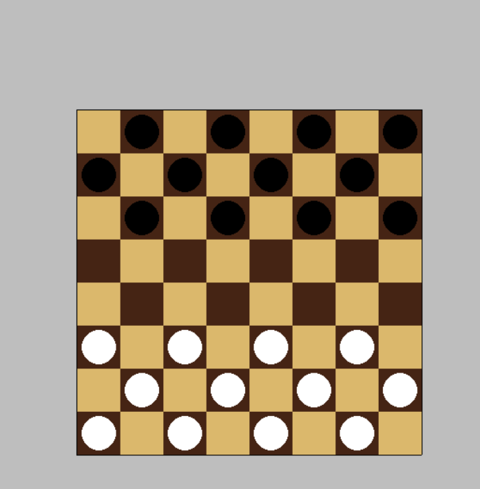
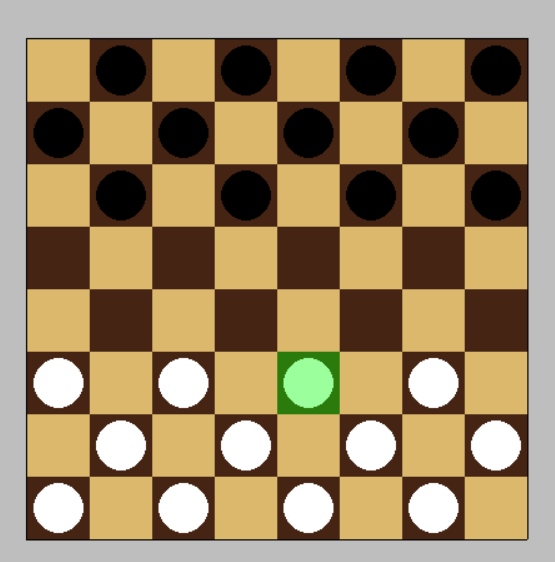

# Write up of the project

I used pygame for this as at the time it was the best fit for me.

Opening a window and getting familiar to the general structure and syntax of it was now the time to start.

First step was to figure out how to draw the board, after some researching I found a writeup by *Keno Leon*: https://medium.com/better-programming/making-grids-in-python-7cf62c95f413.

## Day 1: Drawing the board
I managed to draw the board after 5 hours of trial and error thanks to the write up above.
Now step 2 is to figure out how to alternate colors from black to white for each cell and to actually link each cell to something I can change and work with.
The solution: Matrices.

Using `numpy` I made a matrice with alternating `1` and `0` and used a `for` loop that checks for `1` and colors it black, same for `0`

After finishing the board, I tweaked and polished the code and called it a rest.

## Day2: The pieces

After getting the board done now it's time for the pieces, I wrote a function that draws a circle in the middle of the square and got the dimensions of said center from the function that draws the board.

Then I had to think of a way to know which would be colored white and which would be black. So, based on the same idea of the board I made a matrice that places `'w'` for white and `'b'` for black, worked great! 

Here I found myself in front of a problem. That being in the future when I implement movement and turns, each time a piece gets moved the whole board would be drawn again which could get laggy.
To remediate that I had to separate the functions `drawBoard()` from `placePieces()` and for that I made some variables global constants so any functions could use em which got the job done!

## Day 3: The highlight
Today was a hard one, I wanted to make the selected cells highlighted, after lot of thinking I had an idea!
First I ought to extract the row and column ie the cell from a click, I first search on how to get the position of the cursor, then calculated the distance between it and the origin of the grid, afterward I derived row and col from the formula I used to draw the cells, 
After getting the row and col I established a direct link between the graphical grid and the matrix representing it, which would make it easier in the future. Now for our actual goal, I  struggled to draw the highlight, tried various failed method, the one I settled with was making a second surface, and draw a transparent green square. The idea of a second surface occured to me when I realized that to use the alpha layer of a color I need to specify it on the surface so I did.

A lot of meddling after I separated the process into 4 functions:
- `getRowCol()` does what it's name says
- `containsPiece()` checks if that cell has a piece in it
- `selectedPieceCoordinates()` gets the result of contains piece and returns it, the reason why I did it will be shown later since this function will be useful outside of this too
- `drawHighlight()` gets an argument `selected`, this argument stores the current selected cell coordinates, the function deletes any previous drawing in the second surface and draws the highlight
  
To make everything work in the `main` function I check for any click and if one is detected `selected` stores the coordinates using `selectedPieceCoordinates()`, I do another check after so that if selected isn't empty `drawHighlight()` does it's job!
