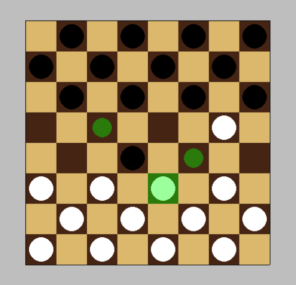

# Write up of the project

I used pygame for this as at the time it was the best fit for me.

Opening a window and getting familiar to the general structure and syntax of it was now the time to start.

First step was to figure out how to draw the board, after some researching I found a writeup by *Keno Leon*: https://medium.com/better-programming/making-grids-in-python-7cf62c95f413.

## Day 1: Drawing the board
I managed to draw the board after 5 hours of trial and error thanks to the write up above.
Now step 2 is to figure out how to alternate colors from black to white for each cell and to actually link each cell to something I can change and work with.
The solution: Matrices.

Using `numpy` I made a matrice with alternating `1` and `0` and used a `for` loop that checks for `1` and colors it black, same for `0`

After finishing the board, I tweaked and polished the code and called it a rest.

## Day2: The pieces

After getting the board done now it's time for the pieces, I wrote a function that draws a circle in the middle of the square and got the dimensions of said center from the function that draws the board.

Then I had to think of a way to know which would be colored white and which would be black. So, based on the same idea of the board I made a matrice that places `'w'` for white and `'b'` for black, worked great! 

Here I found myself in front of a problem. That being in the future when I implement movement and turns, each time a piece gets moved the whole board would be drawn again which could get laggy.
To remediate that I had to separate the functions `drawBoard()` from `placePieces()` and for that I made some variables global constants so any functions could use em which got the job done!

## Day 3: The highlight
Today was a hard one, I wanted to make the selected cells highlighted, after lot of thinking I had an idea!
First I ought to extract the row and column ie the cell from a click, I first search on how to get the position of the cursor, then calculated the distance between it and the origin of the grid, afterward I derived row and col from the formula I used to draw the cells, 
After getting the row and col I established a direct link between the graphical grid and the matrix representing it, which would make it easier in the future. Now for our actual goal, I  struggled to draw the highlight, tried various failed method, the one I settled with was making a second surface, and draw a transparent green square. The idea of a second surface occured to me when I realized that to use the alpha layer of a color I need to specify it on the surface so I did.

A lot of meddling after I separated the process into 4 functions:
- `getRowCol()` does what it's name says
- `containsPiece()` checks if that cell has a piece in it
- `selectedPieceCoordinates()` gets the result of contains piece and returns it, the reason why I did it will be shown later since this function will be useful outside of this too
- `drawHighlight()` gets an argument `selected`, this argument stores the current selected cell coordinates, the function deletes any previous drawing in the second surface and draws the highlight
  
To make everything work in the `main` function I check for any click and if one is detected `selected` stores the coordinates using `selectedPieceCoordinates()`, I do another check after so that if selected isn't empty `drawHighlight()` does it's job!

## Day 4: Possible moves
I'm very proud of this day! Today's goal was to compute the possible moves, store them and show them.

The implementation I did yesterday for highlighting the selected piece really paid off and skipped a lot of work for me today. 

First thing I did was get the selected cell row and col and print the next moves that being `row+1, col+-1` for black and `row-1, col+-1` for white in the new function `getPossibleMoves()`. I then started going over cases like if a piece is in the edge. Basically I did **ALOT** of `if` checks to go over all the possible edge cases for both white and black, with the help of a helper function `isEmpty()` which as the name suggests checks if the provided cell is empty. I am aware this isn't the most optimal solution but hey, if it works it works.

I then made a second function `drawPossibleMoves()` which does what the name suggests. Bingo!

I was feeling proud and well so I tought why not tackling capturing case, in `getPossibleMoves()` I added more edge cases to check if the one of the 2 cells diagonally have an opposite color piece and if so and only if it is empty and in bound can render it.

 

## Day 5: Mouvement and captures
Today, I told myself I would just make a hover effect on the possible moves squares which after lots of meddling I did! Process was weird and I had to redo A lot of stuff, but done nonetheless.

But the highlight of today was when I continued, and added movement. This showed me a lot of problems in my existing program, mainly `getPossibleMoves()` which was an amalgomy of if statements. I redid it and now it looks sexy af! Mouvement was surprisingly simple, I moved the piece in the matrix and voila, moved on the grid aswell. 

Capturing needed an another approach to the piece being captured. What I did was in the possible moves, I added 2 variables representing captured_row and captured_col and when they exists i.e aren't 0, then I delete the piece with those coordinate.

I'm very proud of how this is coming along, next step is making it turn based which could be a struggle!

## Day 6: Turns and Kings
Well, turns were way easier than expected. I'm sure it's not the most optimal way but clever nonetheless. I made a variable `turn` and a dictionary `turns = {0: 'w', 1: 'b'}`. The main idea is incrementing turn after every move so basically if `turn` is even then it's white and if it is odd then it is black.

In the main gameloop where I checked if `selected` exist I add this check:
`and piecesmap[selected[0]][selected[1]]==turns[turn%2]`, if the selected cell color matches the turn's color then and only then make a move.

Again I know there are ALOT of ways to better this but it's working and I came up with it soooooo Jackpot!!

Now for the kings, in checkers, whenever a piece reaches the opposite's side last row it becomes a king, capable of performing bishop's move i.e all 4 diagonals.
After many trial and error I implemented it and symbolized it with `W` and `B`.

Mouvement down now for captures, a clever idea I had is instead of appending the captured move, I made a variable `captured` which stores the captured piece, then continue checking the rest of the diagonal.

Scrap that crap I redid the whole capturing again, this time a `captured` array that stores all the pieces captured so far, useful and made double capturing possible, but normal capturing is fucked and I spent 30 minutes figuring out why the fuck does this happen, what I opted for was if there is a normal capture I append the captured piece coordinates aswell as the original one, and I check if `captured` is 4 elements long I check if it's the same only then delete, tedious, but working, and Mine!

I can see the end mark and I've been having fun making this project!